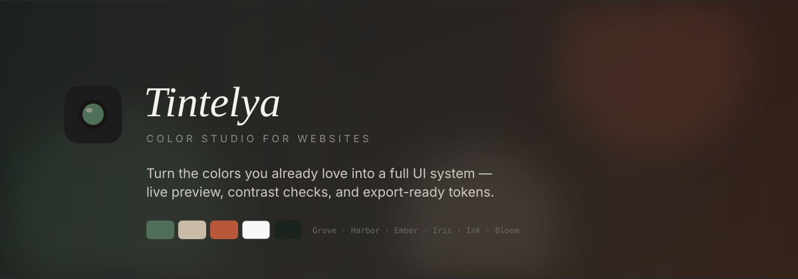

<p align="center">
  
</p>

<h1 align="center">Tintelya</h1>

<p align="center">
  <strong>A color studio for websites.</strong><br />
  Start with colors you already love. Tintelya turns them into a full UI palette —<br />
  then shows the result on a real layout so you can see if it actually works.
</p>

<p align="center">
  <a href="https://nextjs.org/"></a>
  <a href="https://www.typescriptlang.org/"></a>
  <a href="https://react.dev/"></a>
  
</p>

---

## Why Tintelya?

Most palette tools stop at a grid of hex codes. Tintelya is built for the gap between “pretty swatches” and “shippable UI tokens.”

No account and no backend for palette logic — generation runs in your browser.
Google Fonts are loaded from Google’s servers for typography.

---

## Features

- **Seed colors** — Up to five hex values. In “Your colors” harmony, all five influence the palette.
- **Moods** — Modern, Soft, Pastel, Vibrant, Minimal, Dark remap surfaces and type.
- **Harmony** — Keep your colors, or derive secondary/accent relationships.
- **Live website preview** — Desktop / tablet / mobile frames.
- **WCAG contrast checks** — Selected token pairs graded AA / AAA / fail (not a full-page audit).
- **Export** — HEX list, CSS variables, Tailwind `@theme`, JSON — all semantic tokens including onPrimary / onSecondary / onAccent.
- **Saved locally** — `localStorage` in this browser. Palette math stays on-device; font files may still be requested from Google Fonts.

---

## Quick start

```bash
git clone https://github.com/hoshiko9011/Tintelya.git
cd Tintelya
npm install
npm run dev
```

| Script | What it does |
| --- | --- |
| `npm run dev` | Local development server |
| `npm run build` | Production build |
| `npm run start` | Serve the production build |
| `npm run lint` | ESLint |
| `npm test` | Unit tests (color + palette + history) |

---

## License

[MIT](./LICENSE)

---

<p align="center">
  <sub>Made for quieter websites · Tintelya</sub>
</p>
